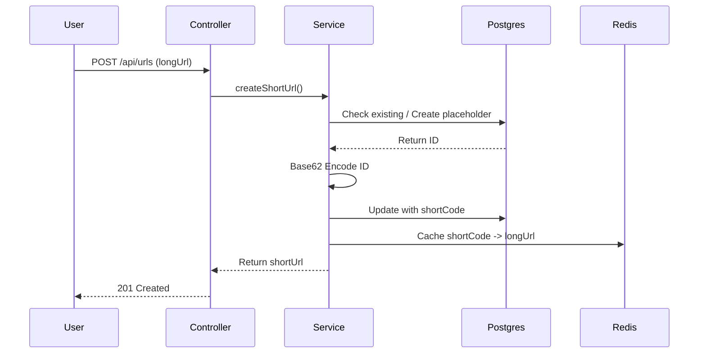
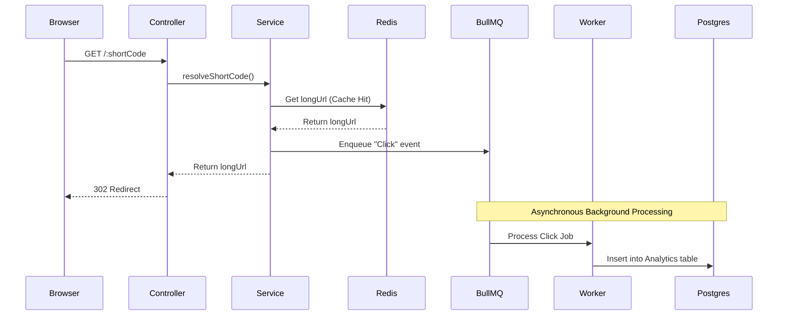

# System Architecture 🏗️

This document outlines the architectural decisions, system design, and data flow of the NanoURL backend.

## 📐 Design Philosophy

NanoURL is built following **Domain-Driven Design (DDD)** and a layered architecture to ensure separation of concerns, testability, and scalability.

### Layers
1.  **Routes**: Defines API endpoints and connects them to controllers.
2.  **Controllers**: Handles HTTP requests/responses, validates input, and delegates to services.
3.  **Services**: Contains the core business logic. It is agnostic of the transport layer (Express).
4.  **Repositories**: (Abstracted via Prisma) Handles all database interactions.
5.  **Queues/Workers**: Manages asynchronous background tasks.

---

## 🔄 Core Flows

### 1. URL Shortening Flow


### 2. Redirect & Analytics Flow (The "Fast Path")
Redirection is optimized for speed. Analytics are processed out-of-band.



---

## 🛠️ Key Architectural Decisions

### 1. JWT in httpOnly Cookies
- **Problem**: Storing JWTs in `localStorage` makes the app vulnerable to XSS.
- **Solution**: Tokens are sent via `httpOnly` cookies. This prevents JavaScript from accessing the token, effectively mitigating XSS-based token theft.

### 2. Base62 Encoding
- **Problem**: UUIDs or long strings are not user-friendly for short URLs.
- **Solution**: We use the database's auto-incrementing `BigInt` ID and convert it to **Base62** (0-9, a-z, A-Z). This results in short, clean alphanumeric codes that are sequential and efficient for indexing.

### 3. Background Analytics with BullMQ
- **Problem**: Writing analytics to the database on every click adds latency to the redirect.
- **Solution**: We push analytics metadata to a **Redis-backed BullMQ queue**. The API responds immediately with the redirect, while a separate worker process handles the database writes.

### 4. Cache-First Strategy
- **Problem**: Database lookups on every redirect are expensive under high load.
- **Solution**: Every shortened URL is cached in Redis with a TTL. The system always checks Redis first, ensuring O(1) lookup time for redirects.

---

## 📁 Directory Structure

```text
src/
├── config/          # Infrastructure config (Prisma, Redis, Env)
├── middlewares/     # Global Express middlewares (Auth, Rate Limit)
├── modules/         # Domain-driven feature modules
│   ├── auth/        # Registration, Login, Session
│   ├── urls/        # Shortening, Redirection
│   └── analytics/   # Stats, Reporting
├── queues/          # BullMQ queue & worker definitions
├── utils/           # Shared helpers (Base62, Errors)
├── app.ts           # Express app composition
└── server.ts        # Entry point & server bootstrap
```
